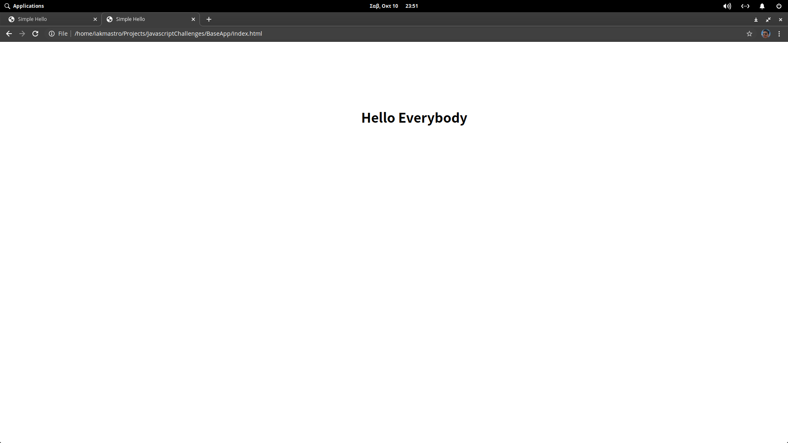

# JavascriptChallenges

### Introduction

I made this challenge to myself to get better at front-end programming using HTML, CSS and pure Javascript, taking on challenges based on a simple base app.

### First Challenge
The first challenge I took was to make a simple program that reads the name and surname of a use and alerts a message.

